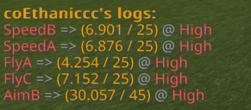
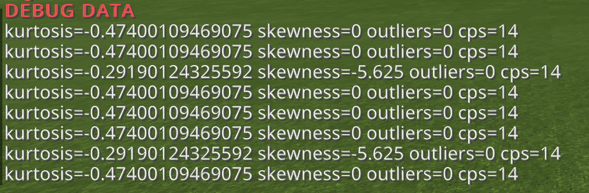

# Mockingbird
Mockingbird is an anti-cheat in development made for fun by an ethic idot - version v2 has
many changes compared to the v1 variants of Mockingbird.

Important Notes:
- **You want a decent server to handle everything Mockingbird is going to do with the least amount of false positives (such as WitherHosting's $1.25 plan).**
- **Waterdog may bring up issues while using Mockingbird, if you use Waterdog along with Mockingbird, know that things may go wrong.**

Here's something I want to relay before moving forward:
1) If you have an issue with Mockingbird (constant falsing, too much cpu usage, etc.) **please** make an issue
on the GitHub repository with details, so I can fix it. You can leave a bad review but **please** make an issue :)
2) Find a bypass (for movement detections only)? Make an issue on the GitHub repository with a video.
3) Got a feature suggestion? Don't put it in reviews - make an issue on the GitHub repository.

Special Thanks To:
- shura62
- Blackjack200
- Jonhan
- (discord) @very nice name#6789
- Bavfalcon9

     
    <h3>WitherHosting</h3>
    
WitherHosting is the hosting company that Mockingbird's test server runs on. It is very affordable (I used to use the $1.25 multi-server plan) and
    has very good performance from what I have seen. They were kind enough to give me a good test server without cost, and I really do appreciate it!
    You can check out WitherHosting and their services by clicking <b><a href="https://billing.witherhosting.com/store/">here</a></b>!

    <h3>Test Server Details</h3>
    
<b>IP:</b> 104.128.48.53

    
<b>Port:</b> 19138

## V2 Changes
**Mockingbird's base inspiration comes from [Neptune](https://github.com/shura62/Neptune/) made by shura62**

TLDR (if you don't care about all the dev stuff): **__Same checks, and new base__**.
TLDR List:
- New Base
- Same and new checks
- More accurate
- Cheat probability
- Reward system (for when players pass checks to prevent falses)
- Less CPU Usage

Well, first things first - detection modules are no longer event listeners, instead, Detections
extend a Detection class which has a function called "process" which runs every time a packet gets received from the player.

Before Detections process data though, "processors" process data before the check. These processors
handle data and save them into the player's "User" class so all checks can use them. For instance, the FlyA
check gets the User's move delta (vector3) and does math from there.

Every time a player joins, it will register a "User" class for them. All available check instances will
be cloned from Mockingbird's main class made when the plugin enables and put in a "checks" property in the User. Processors however, are hardcoded.

Mockingbird no longer calls custom events.

There will not be a resetting violation feature unless Mockingbird is still false-punishing users.
Instead, every time a user passes a check, they will be "rewarded". In rewarding, the player's violations
for the check gets multiplied by a very small amount (multiplier varies based off the check). This will help with players which
might false positive some checks at certain points, and is more effective than resetting all the player's violations. 

Detections now have "cheat probability". What this will do is estimate the chance of cheating.
This is determined by how many times a player flags a certain check a certain amount of times within a period.

Custom modules are still here. Since I'm too lazy to make an example, uh, idk just figure it out or wait I guess.

## Detections
This is a list of all the detections Mockingbird has, these detections may not be 100% accurate
and false at sometimes, but the new reward system should compensate.

### Combat Detections
- Aim
    - (A) -> Yaw delta to pitch delta check
    - (B) -> GCD diff check
- AutoClicker
    - (A) -> Consistency
    - (B) -> Speed
    - (C) -> Statistics
    - (D) -> Duplicated Statistics
- KillAura
    - (A) -> MultiAura
    - (B) -> NoSwing
- Reach
    - (A) -> Colliding Ray Check w/ Location History
- Hitbox
    - (A) -> Colliding Ray Check
### Movement Checks
- Fly
    - (A) -> Prediction Check
    - (B) -> AirJump Check
    - (C) -> Acceleration Check
- Speed
    - (A) -> Friction Check (flags while using bhop and some other hacks)
    - (B) -> Speed Limit Check
- Velocity
    - (A) -> Vertical Check (**98% by default**)
    - (B) -> Horizontal Check (**95% by default**)
### Player Checks
- Nuker (yep lag compensated in less than 40 lines)
- ChestStealer (yep also lag compensated in less than 40 lines)
- EditionFaker (**pog**)

Mockingbird also has packet checks.
- BadPackets (checks for validity of packets sent)
    * (A) -> Pitch validity check
    * (B) -> MovePlayerPacket consistency check
    * (C) -> Checks if player hits themselves (can be used to bypass some checks?)
- Timer (checks if player is sending too many packets in an instance)
    - (A) -> Balance Check (bad with server lag)

## Commands
### Toggling Alerts
To toggle alerts on/off, all you need to do is run `/mbalerts`. There are no arguments needed for this command,
and the command will turn on/off your alerts, depending on if your alerts are enabled or disabled.
### Getting User Logs
To get the current logs of a player, all you need to do is run `/mblogs <player>`. If the player is found, the command will relay a message with their logs.
If the detection has punishments disabled it will not show the max violations.

Format with punishments enabled: `Detection Name => (currentViolations / maxViolations) @ Cheating Probability`

Format with punishments disabled: `Detection Name => (currentViolations) @ Cheating Probability`

### Getting User Debug Log Data
This command is useful for getting debug information in-game, which can help if you are having an issue.
To get a user's debug information for a certain detection, you can run `/mbdebug <player> <detection_name>`.

## Custom Detections
TODO: If you want to make a pull request please do so because I'm a lazy potato :p